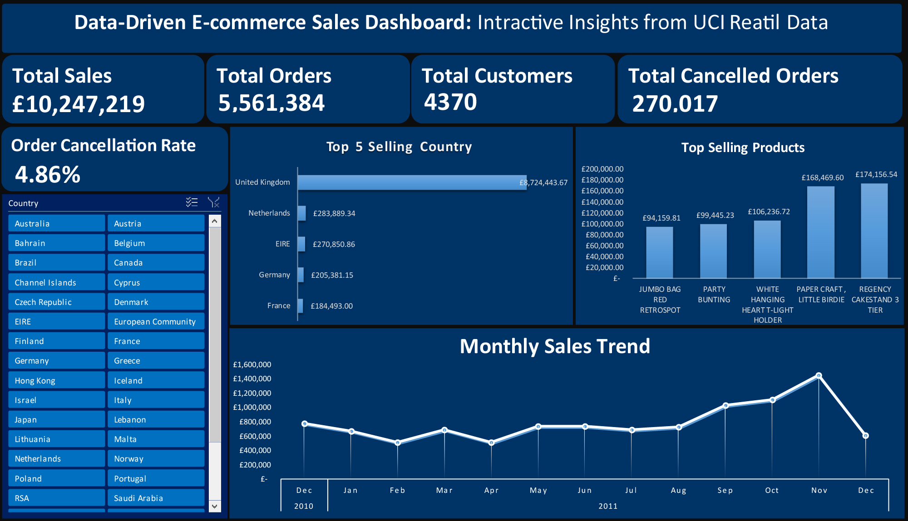

# **Data-Driven E-commerce Sales Dashboard (UCI Retail Data)**

This project showcases a real-world Excel-based sales dashboard created using the **UCI Online Retail Dataset**. It demonstrates my ability to clean, analyze, and visualize transactional data in a business context — built as part of my data analytics learning journey.

---

## **Project Overview**

- **Dataset:** UCI Online Retail Dataset  
- **Records:** ~541,909 transactions  
- **Period:** December 1, 2010 – December 9, 2011  
- **Source:** UK-based online retail store selling gift/household items  

**Business Goal:** Analyze historical sales transactions to extract insights for performance optimization and customer segmentation.

---

## **Objectives**

- Clean and transform real-world sales data  
- Engineer features like Total Sales and Monthly trends  
- Build an interactive dashboard using Excel Pivot Tables and Slicers  
- Showcase visual storytelling and business insights  

---

## **Key Features**

- **KPI Cards:** Total Sales, Total Orders, Total Customers, Order Cancellation Rates  
- **Top Performers:** Best-selling products and revenue by country  
- **Sales Trends:** Monthly performance overview   
- **Interactivity:** Filters via Slicers (Country)  

---

## **Tools & Skills Used**

- **Microsoft Excel**  
- Pivot Tables & Pivot Charts  
- Slicers for interactivity  
- Data cleaning & transformation  
- Dashboard layout & design  
- Visual storytelling with data  

---

## **Getting Started**

1. Download the dataset → [UCI Repository](https://archive.ics.uci.edu/ml/datasets/online+retail)  
2. Download the Excel dashboard file in this repository:  
   `Data-Driven E-commerce Sales Dashboard (UCI Retail Data).xlsx`  
3. Open in Excel 2016 or later for full slicer compatibility  
4. Use slicers to interactively explore key business metrics  

---

## **Preview**

## **Files Included**

- `Data-Driven E-commerce Sales Dashboard (UCI Retail Data).xlsx` – Final Excel Dashboard  
- `data-driven-ecommerce-dashboard.jpg` – Dashboard image preview  
- `README.md` – Project documentation  

---

## **About the Dataset**

- **Source:** [UCI Machine Learning Repository](https://archive.ics.uci.edu/ml/datasets/online+retail)  
- **Size:** ~24 MB (original CSV)  
- **Fields:** InvoiceNo, StockCode, Description, Quantity, InvoiceDate, UnitPrice, CustomerID, Country  

---

## **Author**

**Jamil Ahmad**  
Open to freelance & entry-level data analytics opportunities.  
- Email: Jamil.ad611@gmail.com 

---

## **License**

This project uses public data from the UCI Machine Learning Repository and is for educational purposes only.
